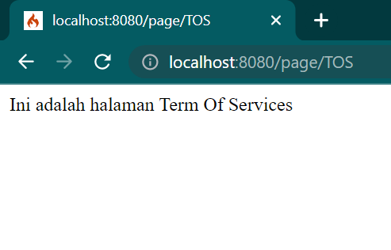

| Nama      | SHOBAHUS SOLICHIN |
| ----------- | ----------- |
| NIM     | 312010076      |
| Kelas   | TI.20.A.1        |

### Pengerjaan
1. Buka xampp control lalu kalian klik start dan klik config lalu pilih PHP(php.ini)<br>
<br>
2. Lalu kalian hapus tanda (;) pada bagian extension=intl seperti berikut<br>
<br>
3. Untuk melakukan instalasi Codeigniter 4 dapat dilakukan dengan dua cara, yaitu cara manual dan menggunakan composer. Pada praktikum ini kita menggunakan cara
manual.
- Unduh Codeigniter dari website https://codeigniter.com/download
- Extrak file zip Codeigniter ke direktori htdocs/lab11_ci.
- Ubah nama direktory framework-4.x.xx menjadi ci4.
- Buka browser dengan alamat http://localhost/lab11_ci/ci4/public/

4. Kalian buka CMD dengan cara buka kembali xampp control lalu pilih bagian Shell, selanjutnya kalian tulis seperti dibawah ini<br>
<br>
5. Selanjutnya kalian tulis php spark maka akan muncul seperti dibawah ini<br>
<br>
6. Selanjutnya kita akan mengaktifkan fitur debugging untuk mengatahui pesan error, jika belum aktif maka tampilannya akan seperti dibawah ini<br>
<br>
7. Untuk mengaktifkannya kalian buka env ubah atau rename menjadi .env, lalu kalian hapus (#) pada CI_ENVIRONMENT dan ubah juga menjadi development seperti berikut<br>
<br>
8. Lalu coba kita hapus tanda (;) pada Home.php maka akan memunculkan info terjadi kesalahan pada bagian tertentu seperti dibawah ini<br>
<br>
9. Setelah semua selesai, disini saya akan membuat router baru seperti berikut di File Routes terletak pada file app/config/Routes.php<br>
<br>
10. Lalu kita cek lagi apakah router sudah benar pada Shell di xampp control tadi dengan tulis php spark routes, jika sudah maka tampilannya akan menjadi seperti berikut<br>
<br>
11. Lalu kita cek about di web page, maka tampilannya akan seperti berikut<br>
<br>
12. Selanjutnya kita akan membuat controller dengan membuat file baru dengan nama page.php pada folder Controllers<br>
```php
<?php
namespace App\Controllers;
class Page extends BaseController
{
    public function about()
    {
        return view('about', [
            'title' => 'Halaman About',
            'content' => 'Ini adalah halaman about yang menjelaskan tentang isi halaman ini.'
        ]);
        
    }

    public function contact()
    {
        echo "Ini adalah halaman Contact";
    }

    public function faqs()
    {
        echo "Ini adalah halaman FAQ";
    }
    public function TOS()
    {
        echo "Ini adalah halaman Term Of Services";
    }
    public function article()
    {
        return view('article', [
            'title' => 'Halaman Article',
            'content' => 'Ini Adalah Halaman Article'
        ]);
    }
}
```
Berikut tampilannya<br>
<br>
13. Selanjutnya kita akan membuat auto routing disini kalian bisa menambahkan syntax dibawah ini pada folder config > Routes.php<br> Dan juga syntax berikut pada folder Controllers > page.php<br>
Maka tampilannya akan menjadi berikut ini<br>
```php
$routes->setAutoRoute(true);
```

```php
public function TOS()
    {
        echo "Ini adalah halaman Term Of Services";
    }
```
<br>

14.Buat file css pada direktori ``public`` dengan nama ``style.css`` (copy file dari praktikum ``lab4_layout``. Kita akan gunakan layout yang pernah dibuat pada praktikum 4.

<br>

Kemudian buat folder template pada direktori view kemudian buat file ``header.php`` dan ``footer.php``
```php
<!DOCTYPE html>
<html lang="en">
<head>
    <meta charset="UTF-8">
    <title><?= $title; ?></title>
    <link rel="stylesheet" href="<?= base_url('/style.css');?>">
</head>
<body>
    <div id="container">
        <header>
            <h1>Layout Sederhana</h1>
        </header>
        <nav>
            <a href="<?= base_url('/');?>" class="active">Home</a>
            <a href="<?= base_url('/artikel');?>">Artikel</a>
            <a href="<?= base_url('/about');?>">About</a>
            <a href="<?= base_url('/contact');?>">Kontak</a>
        </nav>
        <section id="wrapper">
            <section id="main">
```
<br>

File ``app/view/template/footer.php``
<br>

Kemudian ubah file ``app/view/about.php`` seperti berikut.
```php
<?= $this->include('template/header'); ?>
<h1><?= $title; ?></h1>
<hr>
<p><?= $content; ?></p>
<?= $this->include('template/footer'); ?>
```
<br>

Selanjutnya refresh tampilan pada alamat http://localhost:8080/about

<br>


### Jawaban Pertanyaan & Tugas
- Ubah isi pada Routes.php menjadi berikut,

<br>


- Pada ``Controllers/page.php``, menjadi berikut
```php
<?php
namespace App\Controllers;

class Page extends BaseController
{
    public function rumah()
    {
        return view('rumah', [
        'title' => 'Halaman Home',
        'content' => 'Ini adalah halaman home yang menjelaskan tentang isi
        halaman ini.'
        ]);
    }

    public function about()
    {
        return view('about', [
        'title' => 'Halaman About',
        'content' => 'Ini adalah halaman about yang menjelaskan tentang isi 
        halaman ini.'
        ]);
    }

    public function contact()
    {
        return view('contact', [
        'title' => 'Halaman Contact',
        'content' => 'Ini adalah halaman contact yang menjelaskan tentang isi 
        halaman ini.'
        ]);
    }

    public function artikel()
    {
        return view('artikel', [
        'title' => 'Halaman Artikel',
        'content' => 'Ini adalah halaman artikel yang menjelaskan tentang isi 
        halaman ini.'
        ]);
    }

    public function faqs()
    {
        return view('faqs', [
            'title' => 'Halaman FAQ',
            'content' => 'Ini adalah halaman FAQ yang menjelaskan tentang isi 
            halaman ini.'
            ]);
    }

    public function tos()
    {
        return view('tos', [
        'title' => 'Halaman TOS',
        'content' => 'Ini adalah halaman Terms of Service yang menjelaskan tentang isi 
        halaman ini.'
        ]);
    }
}
```

Pada masing-masing file di dalam Views, buat file baru denga nama : ``rumah.php``,``about.php``,``artikel.php``,``contact.php``,``faqs.php``, dan ``tos.php``. Masukan kode dibawah ini ke semua file tersebut
```php
    <?= $this->include('template/header'); ?>
    <h1><?= $title; ?></h1>
    <hr>
    <p><?= $content; ?></p>
    <?= $this->include('template/footer'); ?>
```
Untuk melihat hasilnya dengan menggunakan
alamat: http://localhost:8080/contact

<br>

## Praktikum 12 | Framework Lanjutan (CRUD)</span>

## 1. Database
- Jalankan ``Apache, MySql`` pada Xampp, Buat database dengan nama ``lab_ci4`` di http://localhost/phpmyadmin.
- Buat tabel dengan nama ``artikel``.
    ```sql
    CREATE TABLE artikel (
        id INT(11) auto_increment,
        judul VARCHAR(200) NOT NULL,
        isi TEXT,
        gambar VARCHAR(200),
        status TINYINT(1) DEFAULT 0,
        slug VARCHAR(200),
        PRIMARY KEY(id)
    );
    ```

<br>

## 2. Konfigurasi Koneksi Database
- Terletak di folder ``ci4``, file `.env`, Hapus tanda `#`.

<br>

## 3. Membuat Model 
- Terletak di folder `app/Models`, buat file `ArtikelModel.php`.

<br>

## 4. Membuat Controller 
- Terletak di folder `app/Controllers`, buat file `Artikel.php`.

<br>

## 5. Membuat View pada artikel 
- Terletak di folder `app/Views/artikel`, buat file `index.php`.

<br>

- Buka browser, ketik http://localhost:8080/artikel 

<br>

- Masukkan data ke tabel artikel,
    ```sql
    INSERT INTO artikel (judul, isi, slug) VALUE
    ('Artikel pertama', 'Lorem Ipsum adalah contoh teks atau dummy dalam industri 
    percetakan dan penataan huruf atau typesetting. Lorem Ipsum telah menjadi 
    standar contoh teks sejak tahun 1500an, saat seorang tukang cetak yang tidak 
    dikenal mengambil sebuah kumpulan teks dan mengacaknya untuk menjadi sebuah 
    buku contoh huruf.', 'artikel-pertama'), 
    ('Artikel kedua', 'Tidak seperti anggapan banyak orang, Lorem Ipsum bukanlah 
    teks-teks yang diacak. Ia berakar dari sebuah naskah sastra latin klasik dari 
    era 45 sebelum masehi, hingga bisa dipastikan usianya telah mencapai lebih 
    dari 2000 tahun.', 'artikel-kedua');
    ``` 
<br>

- Refresh kembali browser.

<br>

## 6. Membuat Tampilan detail Artikel
- Terletak di folder `app/Controllers`, edit file `Artikel.php`. Tambah method ``view()``.

<br>

## 7. Membuat View pada Detail
- Terletak di folder `app/Views/artikel`, buat file `detail.php`.

<br>

## 8. Membuat Routing untuk artikel detail
- Terletak di folder `app/Config`, edit file `Routes.php`.

<br>

- Klik `Artikel Kedua` pada http://localhost:8080/artikel, untuk pindah ke detailnya.

<br>

## 9. Membuat Menu admin
- Terletak di folder `app/Controller`, edit file `Artikel.php`. Tambah method `admin_index()`.

<br>

- Selanjutnya, akses kembali folder `app/Views/artikel`, buat file `admin_index.php`.
    ```php
    <?= $this->include('template/admin_header'); ?>
    <table class="table table-bordered table-hover">
        <thead>
            <tr class="table-primary">
                <th scope="col">ID</th>
                <th scope="col">Judul</th>
                <th scope="col">Status</th>
                <th scope="col">Aksi</th>
            </tr>
        </thead>
        <tbody>
            <?php if($artikel): foreach($artikel as $row): ?>
            <tr>
                <td><?= $row['id']; ?></td>
                <td>
                    <b><?= $row['judul']; ?></b>
                    <p><small><?= substr($row['isi'], 0, 50); ?></small></p>
                </td>
                <td><?= $row['status']; ?></td>
                <td>
                    <a class="btn btn-primary p-1" href="<?= base_url('/admin/artikel/edit/' . 
                    $row['id']);?>">Ubah</a>
                    <a class="btn btn-danger p-1" onclick="return confirm('Yakin menghapus data?');" href="<?= base_url('/admin/artikel/delete/' . 
                    $row['id']);?>">Hapus</a>
                </td>
            </tr>
            <?php endforeach; else: ?>
            <tr>
                <td colspan="4">Belum ada data.</td>
            </tr>
            <?php endif; ?>
        </tbody>
        <tfoot>
            <tr class="table-primary">
                <th scope="col">ID</th>
                <th scope="col">Judul</th>
                <th scope="col">Status</th>
                <th scope="col">Aksi</th>
            </tr>
        </tfoot>
    </table>
    <?= $this->include('template/admin_footer'); ?>
    ```
<br>

- Buka folder yang ada di ``app/Views/artikel/template``, kemudian buat:
- ``admin_header.php``,

<br>

- ``admin_footer.php``

<br>

## 10. Membuat Routing untuk menu admin
- Terletak di folder `app/Config`, edit file `Routes.php`.

<br>

- Akses browser dengan http://localhost:8080/admin/artikel.

<br>

## 11. Menambah data untuk Artikel
- Terletak di folder `app/Controller`, edit file `Artikel.php`. Tambah method `add()`.

<br>

- Akses kembali folder `app/Views/artikel`, buat file `form_add.php`.

<br>

- Akses browser dengan http://localhost:8080/admin/artikel/add.

<br>

## 12. Mengubah data pada Artikel
- Terletak di folder `app/Controller`, edit file `Artikel.php`. Tambah method `edit()`.

<br>

- Akses kembali folder `app/Views/artikel`, buat file `form_edit.php`.

<br>

- Akses browser dengan http://localhost:8080/admin/artikel/edit/1 untuk Mengubah artikel pertama.

<br>

## 13. Menghapus data pada Artikel
- Terletak di folder `app/Controller`, edit file `Artikel.php`. Tambah method `delete()`.

<br>

- Akses browser dengan http://localhost:8080/admin/artikel/add untuk membuat artikel ketiga, lalu `kirim`.

<br>

- Untuk mengeceknya ketik di url, http://localhost:8080/artikel kemudian enter.

<br>

- Pergi ke menu admin untuk menghapusnya, http://localhost:8080/admin/artikel, kemudian pilih `hapus`.

<br>

- Artikel berhasil dihapus.

<br>
</div>

# <span style="color: blue">Praktikum 13 | Framework Lanjutan (Modul Login)</span>

## 1. Membuat Table User
- Jalankan ``Apache, MySql`` pada Xampp, Akses browser http://localhost/phpmyadmin.
- Buat tabel dengan nama ``artikel``.
    ```sql
        CREATE TABLE user (
        id INT(11) auto_increment,
        username VARCHAR(200) NOT NULL,
        useremail VARCHAR(200),
        userpassword VARCHAR(200),
        PRIMARY KEY(id)
        );
    ```

<br>

## 2. Membuat Model User
- Terletak di folder `app/Models`, buat file `UserModel.php`.

<br>

## 3. Membuat Controller User
- Terletak di folder `app/Controllers`, buat file `User.php`.

<br>

## 4. Membuat View Login
- Terletak di folder `app/Views`, buat folder baru dengan nama `user`, buat file `login.php` di dalamnya.

<br>

## 5. Membuat Database Seeder
- Untuk keperluan uji coba.
- Masuk ke direktori ci4, kemudian ketikkan kode:
``php spark make:seeder UserSeeder``

<br>

- Terletak di folder `app/Database/Seeds`, buka file `UserSeeder.php`, kemudian edit menjadi berikut:

<br>

- Buka kembali CLI, kemudian ketik perintah berikut:
``php spark db:seed UserSeeder``

<br>

- Berikut data yang sudah ditambah pada tabel `user`. Dengan mengakses ``http://localhost/phpmyadmin``.

<br>

- Buka file `.env`, kemudian hapus `#` pada `app.sessionX`

<br>

- Akses kembali url ``http://localhost:8080/user/login``

<br>

## 6. Menambah Auth Filter
- Terletak di folder `app/Filters`, buat file `Auth.php`

<br>

- Kemudian pada folder `app/Config`, edit isi file `Filters.php` menjadi berikut:
```php
<?php

namespace Config;

use CodeIgniter\Config\BaseConfig;
use CodeIgniter\Filters\CSRF;
use CodeIgniter\Filters\DebugToolbar;
use CodeIgniter\Filters\Honeypot;
use App\Filters\Auth;
use App\Filters\Noauth;
//use CodeIgniter\Filters\InvalidChars;
//use CodeIgniter\Filters\SecureHeaders;

class Filters extends BaseConfig
{
    /**
     * Configures aliases for Filter classes to
     * make reading things nicer and simpler.
     *
     * @var array
     */
    public $aliases = [
        'csrf'          => CSRF::class,
        'toolbar'       => DebugToolbar::class,
        'honeypot'      => Honeypot::class,
        'auth'          => Auth::class,
        'noauth'          => Noauth::class,
        //'invalidchars'  => InvalidChars::class,
        //'secureheaders' => SecureHeaders::class,
    ];

    /**
     * List of filter aliases that are always
     * applied before and after every request.
     *
     * @var array
     */
    public $globals = [
        'before' => [
            // 'honeypot',
            // 'csrf',
            // 'invalidchars',
        ],
        'after' => [
            'toolbar',
            // 'honeypot',
            // 'secureheaders',
        ],
    ];

    /**
     * List of filter aliases that works on a
     * particular HTTP method (GET, POST, etc.).
     *
     * Example:
     * 'post' => ['csrf', 'throttle']
     *
     * @var array
     */
    public $methods = [];

    /**
     * List of filter aliases that should run on any
     * before or after URI patterns.
     *
     * Example:
     * 'isLoggedIn' => ['before' => ['account/*', 'profiles/*']]
     *
     * @var array
     */

    public $filters = [
        'auth' => ['before' =>
            [
                'admin/*',
            ]
        ]
    ];
}
```

- Untuk mencobanya, akses ``http://localhost:8080/artikel``, kemudian tambah menjadi ``http://localhost:8080/admin/artikel`` lalu tekan enter.

<br>

- Otomatis akan dialihkan untuk login terlebih dahulu.

<br>

- Mencoba masuk dengan email `admin@email.com`, dan password `admin123`, kemudian tekan `login`.

<br>

- Berhasil masuk sebagai admin, dan semua menu dapat diakses.Untuk mencobanya klik menu `Artikel`.

<br>

- Kemudian klik menu `Login Admin`, untuk diarahkan ke ``http://localhost:8080/admin/artikel``.

<br>

- Maka akan masuk ke menu admin sebelumnya, tidak login ulang.

<br>

## 7. Membuat Fungsi Logout
- Menambah method logout().
- Terletak di folder `app/Controllers`, buka file `User.php`, kemudian edit menjadi berikut:

<br>

- Untuk mencobanya, klik menu `Logout`.

<br>

- Maka akan langsung diarahkan untuk login ulang, sebelum bisa mengakses menu admin.

<br>

- Namun, untuk ``http://localhost:8080/artikel`` masih dapat diakses.

<br>

</div>

# <span style="color: blue">Praktikum 14 | Pagination dan Pencarian</span>

 <span style="color: blue">Praktikum 14 | Pagination dan Pencarian</span>

## 1. Membuat Pagination
- Terletak di folder ``app/Controllers``, buka file `Artikel.php`. Ubah menjadi berikut :

<br>

- Terletak di folder ``app/Views/artikel``, buka file `admin_index.php`, tambah kode berikut : ``<?= $pager->links(); ?>``

- Halaman 1

<br>

- Halaman 2

<br>

## 2. Membuat Pencarian
- Proses mencari artikel PHP,

<br>

- Artikel ditemukan.

<br>

## 3. Upload Gambar
- Akses kembali ``http://localhost:8080/admin/artikel``. Kemudian pilih menu `Tambah Artikel`.

<br>

- Lalu isi artikel dan pilih gambar.

<br>

- Otomatis diarahkan kembali ke menu admin. Pilih halaman ke-2 (terakhir ditambah). Untuk melihat tampilannya, tekan menu ``artikel``.

<br>

- Berikut tampilannya.

<br>
